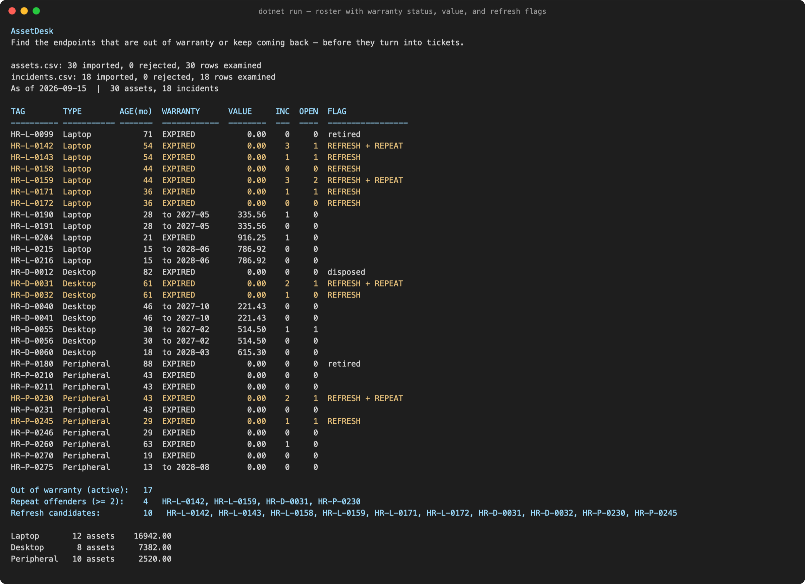
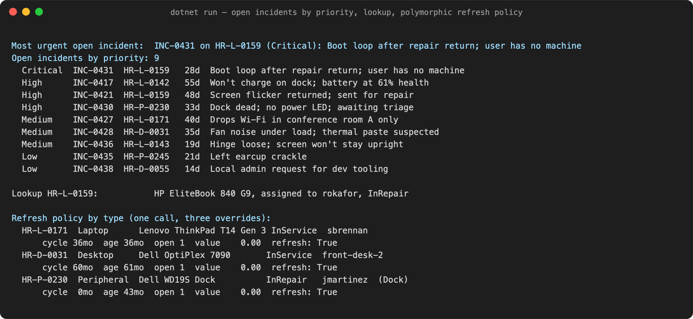
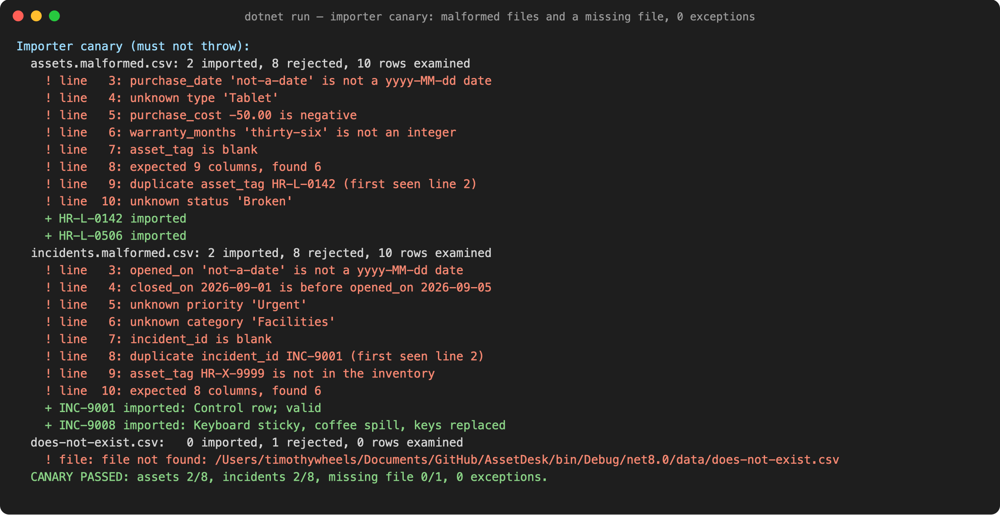

# AssetDesk

Find the endpoints that are out of warranty or keep coming back — before they turn into tickets.

Every help desk has the same two blind spots: the machines that quietly
fall out of warranty, and the machines that keep coming back. Both live
in someone's head or someone's spreadsheet, and both get found the
expensive way — after the ticket, not before. AssetDesk is a console tool
that imports the asset roster you already have, ties incidents to the
devices that generated them, and tells you which endpoints to refresh
before they become tickets.

> **Status:** course project for DeVry SIS250 (Intermediate Programming, C#), Fall 2026.
> Modules 3–6 complete. **License:** MIT.

## Run it

Needs the [.NET 8 SDK](https://dotnet.microsoft.com/download/dotnet/8.0). Nothing else.

```bash
git clone https://github.com/timothywheelspro/AssetDesk.git
cd AssetDesk
dotnet run
```

Sample data ships in `data/` and is copied next to the executable on build, so a clean
clone runs with no setup and no arguments. The last line of output is the importer canary;
if it says `CANARY PASSED`, everything above it is trustworthy.

## What it does

One run, three reports, from two CSV files:

**1. The roster** — every asset with its age, warranty state, book value, incident counts,
and a flag: `REFRESH` (replace it), `repeat` (it keeps coming back), or both.



**2. The triage view** — open incidents sorted Critical→Low with days open, a tag lookup,
and the same refresh question answered by three different asset types.



**3. The importer canary** — the program feeds itself two deliberately broken files and a
path that doesn't exist, and reports what it refused and why. No exception escapes.



The screenshots are rendered from the captured output in
[`docs/screenshots/run-output.txt`](docs/screenshots/run-output.txt) by
[`render.py`](docs/screenshots/render.py) — nothing is retyped.

## The refresh rules

An asset is flagged for refresh when its type's policy says so. The policies differ in
*kind*, not just in number, which is why they are polymorphic overrides and not a lookup table:

| Type | Refresh cycle | Book value | Refresh when |
|---|---|---|---|
| Laptop | 36 months | straight-line to zero over the cycle | age ≥ 36 mo, **or** out of warranty with ≥ 2 open incidents |
| Desktop | 60 months | straight-line to zero over the cycle | age ≥ 60 mo, **or** out of warranty with ≥ 3 open incidents |
| Peripheral | none | 0 — expensed at purchase | in repair, **or** out of warranty with any open incident |

Retired and disposed assets are excluded. A *repeat offender* is any asset with ≥ 2
incidents on record. Full rationale in [`docs/ARCHITECTURE.md`](docs/ARCHITECTURE.md).

## How it's built

```
AssetDesk/
├── Program.cs                 entry point: load, report, canary — no parsing, no policy
├── TriageRules.cs             cross-asset rules: months-in-service, repeat threshold, priority sort
├── Inventory.cs               Asset[] / Incident[] with counts; search, filters, summary
├── Domain/
│   ├── Asset.cs               abstract base: identity, validation, warranty math
│   ├── Laptop.cs              sealed; 36-month policy
│   ├── Desktop.cs             sealed; 60-month policy
│   ├── Peripheral.cs          sealed; failure-driven policy
│   ├── Incident.cs
│   └── Technician.cs
├── Import/
│   ├── AssetCsvImporter.cs    never throws; every bad row becomes a RejectedRow
│   ├── IncidentCsvImporter.cs same contract; cross-checks tags against the inventory
│   ├── ImportResult.cs / IncidentImportResult.cs
│   └── RejectedRow.cs
├── data/                      sample roster + the two malformed files the importers must survive
└── docs/                      ARCHITECTURE.md, screenshots
```

### Design decisions

- **`Inventory` is fixed-size arrays with a count, not `List<T>`.** Filters return exact-size
  arrays via count-then-fill. The cost of that pattern is the point: it's why collections exist.
- **`Asset` is an abstract class, not an interface.** It owns real state (tag, cost,
  warranty) and real shared logic (warranty math, straight-line depreciation). An interface
  can't carry that. Only the two things that genuinely differ per type — `CurrentValue`
  and `IsRefreshEligible` — are abstract. Subclasses are `sealed`.
- **Validation happens once, at the boundary.** The importers reject bad rows; the domain
  constructors reject bad values. Nothing downstream checks for garbage because none gets through.
- **Two kinds of failure, handled two ways.** Bad input we can see coming (`not-a-date`,
  a negative cost) is detected with `TryParse` and an `if`. Only things raised by code we
  don't control — the file system, a constructor — are caught with `try/catch`.
  Exceptions are for the exceptional.

### Built one module at a time

The git history is part of the deliverable. Each module's work landed as its own commit,
and the same numbers (17 out of warranty, 4 repeat offenders, 10 refresh candidates) print
at every step — the structure changed underneath a fixed result.

| Module | Commit | What changed |
|---|---|---|
| M3 methods | [`c7cadf7`](https://github.com/timothywheelspro/AssetDesk/commit/c7cadf7) | `TriageRules` as static pure functions; policy as `switch` on a string |
| M3 arrays | [`77ae9d4`](https://github.com/timothywheelspro/AssetDesk/commit/77ae9d4) | `Inventory` as seventeen parallel arrays with counts |
| M4 classes | [`54ddbb8`](https://github.com/timothywheelspro/AssetDesk/commit/54ddbb8) | `Asset`, `Incident`, `Technician`; parallel arrays collapse into `Asset[]` |
| M5 inheritance | [`33dfe26`](https://github.com/timothywheelspro/AssetDesk/commit/33dfe26) | `Asset` goes abstract; the switches leave `TriageRules` (−90 lines) for three overrides |
| M6 exceptions & files | [`4f99bc8`](https://github.com/timothywheelspro/AssetDesk/commit/4f99bc8), [`ab417d8`](https://github.com/timothywheelspro/AssetDesk/commit/ab417d8) | The importers; `Program.cs` loses its last `Parse()` call |

## Data

See [`data/README.md`](data/README.md) for the schema and, more importantly, for the
row-by-row tables of what `assets.malformed.csv` and `incidents.malformed.csv` are broken
by. Each expects **2 imported, 8 rejected** — that's the acceptance test, and the program
runs it on every start.

## Verification

Every commit body carries the actual `dotnet run` output and `git show --stat`, not a
paraphrase. The rules for that are in [`AGENTS.md`](AGENTS.md) and apply to anyone —
human or agent — who touches the code.

```bash
dotnet build -warnaserror && dotnet run | tail -1
# CANARY PASSED: assets 2/8, incidents 2/8, missing file 0/1, 0 exceptions.
```

## License

MIT — see [`LICENSE`](LICENSE).
