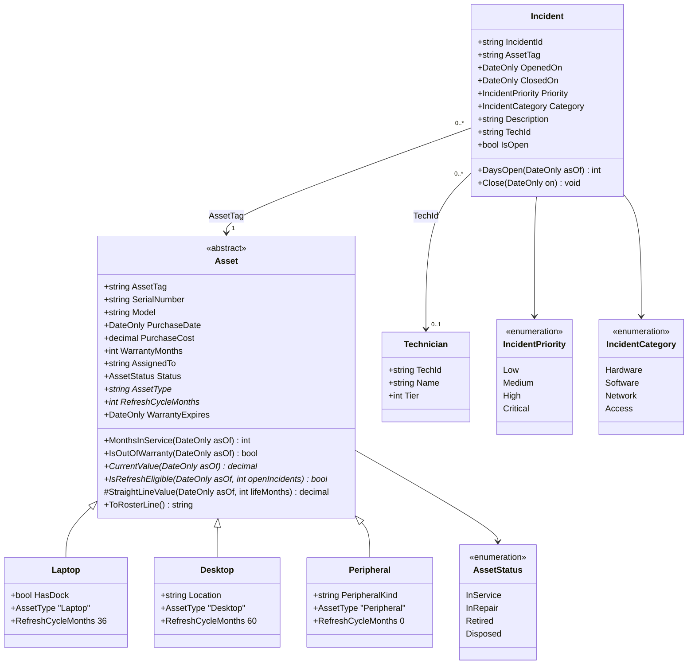
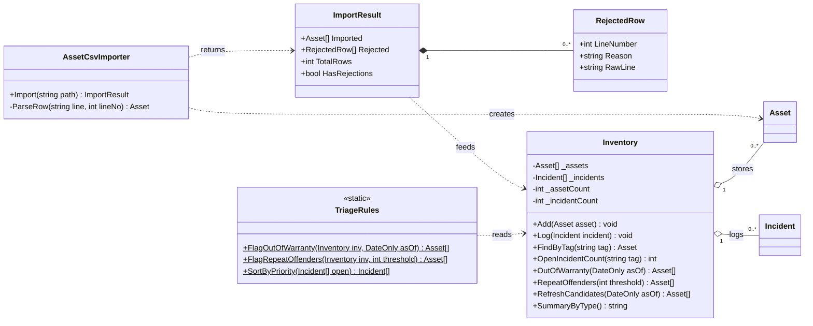

# AssetDesk — Course Project Architecture

> Source of truth for the design. Mirrored from the Notion page of the same name
> (written 2026-09-03); this copy in the repo is canonical from 2026-09-15 onward.
> Short-form rules for agents are in `AGENTS.md`.

**Domain locked:** console-based endpoint inventory and incident tracker in C#. The course
project is the spine; the array utility (`Inventory`) and file utility (`AssetCsvImporter`)
live inside it as separable classes. Repo: `timothywheelspro/AssetDesk` (MIT — move to
Contruil-LLC if it earns it).

**Course:** DeVry SIS250 Intermediate Programming (C#), 8 modules, session started ~2026-09-01.
Discussions: initial post Wednesday, second topic Saturday, peer reply Sunday.

---

## README opening

**Tagline** (under `# AssetDesk` and verbatim in the GitHub About field):

> Find the endpoints that are out of warranty or keep coming back — before they turn into tickets.

**Problem paragraph:**

> Every help desk has the same two blind spots: the machines that quietly fall out of warranty,
> and the machines that keep coming back. Both live in someone's head or someone's spreadsheet,
> and both get found the expensive way — after the ticket, not before. AssetDesk is a console
> tool that imports the asset roster you already have, ties incidents to the devices that
> generated them, and tells you which endpoints to refresh before they become tickets.

---

## Class → module map

Nothing on this page exists that doesn't earn grade points.

| Class | Module | What it proves |
|---|---|---|
| `Program` — intake prompts, warranty-age and cost output | M1 | I/O, data types, arithmetic |
| `TriageRules` | M2, M3 | Decisions, iteration, pure testable functions |
| `Inventory` | M4 | Fixed-size arrays with a count; search / filter / summary. **Extractable array utility.** |
| `Asset`, `Incident`, `Technician` | M5 | Classes, encapsulation, constructor validation |
| `Asset` → `Laptop` / `Desktop` / `Peripheral` | M6 | Inheritance, abstract members, polymorphic dispatch |
| `AssetCsvImporter`, `ImportResult`, `RejectedRow` | M7 | Exception handling, file processing. **Extractable file utility.** |
| All of it + README | M8 | Course project |

### Migration note (M3 → M6)

In M3, warranty math and refresh policy are `static` functions in `TriageRules` that take
primitives (`DateOnly`, `int`, `decimal`, `string assetType`). In M5/M6 the shared math moves
into the abstract `Asset` base class and the per-type policy becomes the polymorphic
`IsRefreshEligible` / `CurrentValue` overrides. `TriageRules` shrinks to the functions that
operate over an `Inventory`. Both versions are kept in git history on purpose.

---

## Class diagram 1 — domain model (M5 / M6)



Shared state and warranty math live in `Asset`. `CurrentValue` and `IsRefreshEligible` are
abstract because the policies differ in *kind*, not just in number. Peripherals are
failure-driven, not age-driven: no depreciation; refresh when `InRepair` or any open incident
while out of warranty.

## Class diagram 2 — data pipeline (M4 / M7)



- **M7:** `AssetCsvImporter` never throws on bad input. Missing file, locked file, malformed
  row all land in `Rejected` with line + reason.
- **M4:** `Inventory` uses fixed-size arrays with a count, not `List<T>`. Search, filter, and
  summary routines are the extractable utility.

---

## The abstract `Asset` contract (M6 reference)

Identity is immutable after construction, custody is mutable, shared math is written once,
and the two things that genuinely differ per type are the only things left abstract.

```csharp
namespace AssetDesk.Domain;

public enum AssetStatus { InService, InRepair, Retired, Disposed }

public abstract class Asset
{
    // Identity: fixed at intake
    public string AssetTag { get; }          // normalised upper-case; primary key
    public string SerialNumber { get; }
    public string Model { get; }
    public DateOnly PurchaseDate { get; }
    public decimal PurchaseCost { get; }
    public int WarrantyMonths { get; }

    // Custody: changes over life
    public string? AssignedTo { get; set; }  // null = unassigned / in stock
    public AssetStatus Status { get; set; } = AssetStatus.InService;

    protected Asset(string assetTag, string serialNumber, string model,
                    DateOnly purchaseDate, decimal purchaseCost, int warrantyMonths)
    {
        if (string.IsNullOrWhiteSpace(assetTag))
            throw new ArgumentException("Asset tag is required.", nameof(assetTag));
        if (purchaseCost < 0m)
            throw new ArgumentOutOfRangeException(nameof(purchaseCost), "Cost cannot be negative.");
        if (warrantyMonths < 0)
            throw new ArgumentOutOfRangeException(nameof(warrantyMonths), "Warranty months cannot be negative.");

        AssetTag = assetTag.Trim().ToUpperInvariant();
        SerialNumber = serialNumber?.Trim() ?? string.Empty;
        Model = model?.Trim() ?? string.Empty;
        PurchaseDate = purchaseDate;
        PurchaseCost = purchaseCost;
        WarrantyMonths = warrantyMonths;
    }

    // The contract
    public abstract string AssetType { get; }
    public abstract int RefreshCycleMonths { get; }         // 0 = replace on failure
    public abstract decimal CurrentValue(DateOnly asOf);
    public abstract bool IsRefreshEligible(DateOnly asOf, int openIncidentCount);

    // Shared behaviour
    public DateOnly WarrantyExpires => PurchaseDate.AddMonths(WarrantyMonths);
    public bool IsOutOfWarranty(DateOnly asOf) => asOf > WarrantyExpires;

    public int MonthsInService(DateOnly asOf)
    {
        int months = (asOf.Year - PurchaseDate.Year) * 12 + (asOf.Month - PurchaseDate.Month);
        if (asOf.Day < PurchaseDate.Day) months--;
        return Math.Max(0, months);
    }

    protected decimal StraightLineValue(DateOnly asOf, int lifeMonths)
    {
        if (lifeMonths <= 0) return 0m;
        decimal remainingFraction = 1m - (decimal)MonthsInService(asOf) / lifeMonths;
        return Math.Round(PurchaseCost * Math.Clamp(remainingFraction, 0m, 1m), 2);
    }

    public virtual string ToRosterLine() =>
        $"{AssetTag,-10} {AssetType,-11} {Model,-24} {Status,-10} {AssignedTo ?? "(unassigned)"}";

    public override string ToString() => ToRosterLine();
}
```

### Reference subclass — `Laptop`

```csharp
namespace AssetDesk.Domain;

public sealed class Laptop : Asset
{
    public bool HasDock { get; set; }

    public Laptop(string assetTag, string serialNumber, string model,
                  DateOnly purchaseDate, decimal purchaseCost, int warrantyMonths,
                  bool hasDock = false)
        : base(assetTag, serialNumber, model, purchaseDate, purchaseCost, warrantyMonths)
    {
        HasDock = hasDock;
    }

    public override string AssetType => "Laptop";
    public override int RefreshCycleMonths => 36;
    public override decimal CurrentValue(DateOnly asOf) => StraightLineValue(asOf, RefreshCycleMonths);

    // Age-driven: past the cycle, or out of warranty and generating repeat tickets.
    public override bool IsRefreshEligible(DateOnly asOf, int openIncidentCount) =>
        MonthsInService(asOf) >= RefreshCycleMonths
        || (IsOutOfWarranty(asOf) && openIncidentCount >= 2);

    public override string ToRosterLine() =>
        base.ToRosterLine() + (HasDock ? "  [dock]" : string.Empty);
}
```

### Subclass policies

| Type | RefreshCycleMonths | CurrentValue | IsRefreshEligible | Own field |
|---|---|---|---|---|
| `Laptop` | 36 | Straight-line to zero over 36 months | Age ≥ 36 months, OR out of warranty with ≥ 2 open incidents | `HasDock` |
| `Desktop` | 60 | Straight-line to zero over 60 months | Age ≥ 60 months, OR out of warranty with ≥ 3 open incidents | `Location` |
| `Peripheral` | 0 (no schedule) | Always 0 — expensed at purchase | Status is `InRepair`, OR any open incident while out of warranty | `PeripheralKind` — Monitor, Dock, Headset, Printer |

### Why an abstract class and not an interface (M6 design note)

- `Asset` owns real state and real shared logic. An interface can't carry that.
- The three refresh policies differ in **kind** — age-driven vs failure-driven — not just in a
  constant. That's what makes `IsRefreshEligible` a design decision instead of a checkbox.
- Validation lives in the base constructor: one gate, enforced once. Same principle as the
  importer — garbage stops at the boundary.
- Subclasses are `sealed`.

---

## CSV schema

See `data/README.md` for column definitions. The `type` column is the factory switch inside
`ParseRow`.

### Rows the importer has to survive without throwing (M7 test cases)

- File doesn't exist → `ImportResult` with one rejected row (line 0, reason names the path)
- File locked (`IOException`) → same shape, different reason
- Empty file, or header only → zero imported, zero rejected, `TotalRows` 0
- Wrong column count
- Unknown `type`
- Unparseable date, negative cost, non-integer warranty
- Duplicate `asset_tag` — second occurrence rejected, first kept
- Blank `asset_tag`
- Blank line — **skipped silently** (decision made 2026-09-15)

`data/assets.malformed.csv` exercises all of these: expected **2 imported, 8 rejected**.

---

## Decisions log

- [x] Sample data: 30 assets, 18 incidents, 3 technicians, plus `assets.malformed.csv`. Shipped `f0331eb`.
- [x] First commit was the README opening (Sep 2); second was the scaffold. Dated proof of build-first.
- [x] License: MIT. Relicense future versions if the repo moves to Contruil-LLC.
- [x] Repo renamed `Assest-Desk` → `AssetDesk` (confirmed 2026-09-15).
- [x] `DateOnly` — .NET 8.0.425 confirmed on the dev machine 2026-09-15. Use `DateOnly`.
- [x] Blank line in CSV → skipped silently, not counted as a rejection (2026-09-15).
- [ ] Confirm the SIS250 course-project prompt allows domain latitude. If not: keep everything on this page, swap the nouns.
- [ ] Set the GitHub About description + topics (browser only).
